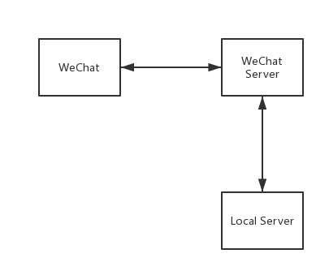

### Wechat-Server

> 在使用前请先仔细阅读 [微信公众平台开发的注意事项](https://mp.weixin.qq.com/wiki?t=resource/res_main&id=mp1445241432) 和 [接入指南](https://mp.weixin.qq.com/wiki?t=resource/res_main&id=mp1421135319)。

#### 快速启动
* 拉去代码。

```shell
git clone git@github.com:FanShiDe/wechat-server.git
```

* 根据个人环境修改配置文件中的配置项。

```shell
cp ./config/default.yml.staging ./config/default.yml
```

* 安装依赖，启动程序。

```shell
cd wechat-server
yarn setup or npm run setup
yarn start or npm run start
```

* 打包应用到dist目录下。
```shell
yarn build or npm run build
```

* 运行打包后的程序。
```shell
cd dist
node index.js
```

#### 注意事项

* 本地的服务器需要指定一个 `GET` 和 `POST` 的`同名接口`。

* `GET`接口用于`验证消息的确来自微信服务器`，即设置在，且验证成功才可使用微信公众平台提供的接口服务，否则失败。`POST`接口用于接收`WeChat Server`的所有请求，可在该接口下做一些业务处理已经微信数据的存储。

* `access_token`是调用微信公众平台接口的凭据，该字段过期时间为`2h`。

* 微信公众平台接口调用仅支持`80(http)`和`443(https)`端口。

* 推荐使用`ngwork`将本地80端口的服务给映射到一个暂时的`http`或`https`地址，然后在接口配置信息中的`URL字段`填入`{该地址/GET接口}`，`Token`字段填入配置文件中指定的`token数据`
  - `ngwork`的使用可自行`Google`。
  - 并不是给`ngwork`打广告，只是喜欢用免费的，hh。

#### 数据流向

* `本地服务器`与`微信`的数据交互都需要经过`微信公众平台提供的后台服务器`.




#### 配置

开发者可自行修改配置文件。

```yml
server:
  host: '0.0.0.0'
  port: 80
db:
  host: '0.0.0.0'
  port: 27017
  db_name: wechatServer
wechatServer:
  url: https://api.weixin.qq.com/
  appID: 开发者申请的appID
  appSecret: 开发者申请的appSecret
  token: 接口配置信息中的token
```

